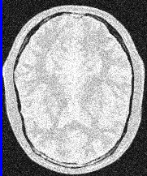
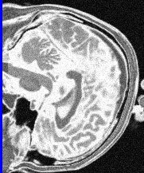
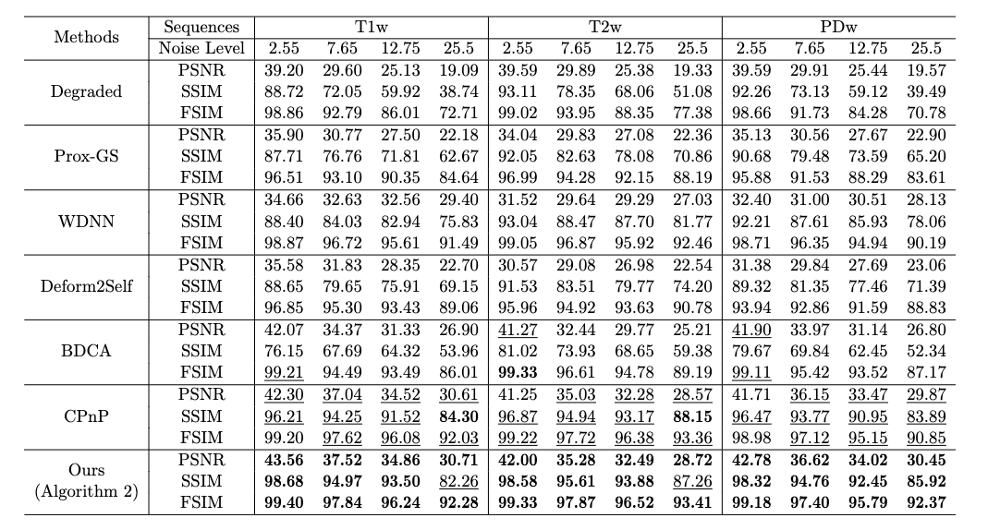
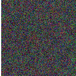
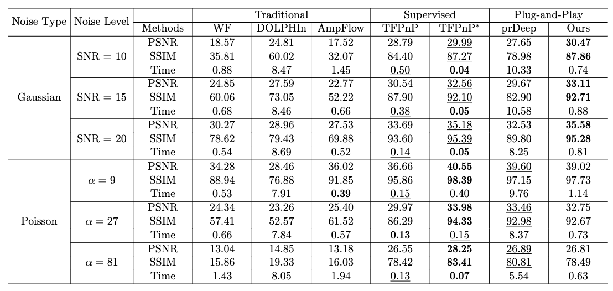

# Inertial Proximal Difference-of-Convex Algorithm with Convergent Bregman Plug-and-Play
[**Tsz Ching Chow**](https://github.com/nicholechow), [**Chaoyan Huang**](https://scholar.google.com/citations?user=Sun7dRgAAAAJ&hl=en&oi=ao), Zhongming Wu, Tieyong Zeng, Angelica I. Aviles-Rivero

[[paper arxiv](https://arxiv.org/pdf/2409.03262)]  

## News
- 2024.09.06 : Initial release of the codebase for the paper "Inertial Proximal Difference-of-Convex Algorithm with Convergent Bregman Plug-and-Play". Code will be released soon after the paper is accepted.

## Prerequisites:
This code requires `torch>= 1.8.0` and `pytorch-lightning`. Please install dependencies by running the following command:
```
conda env create -f environment.yml
```


Rician Noise Removal (added parula colormap for better visualization)
----------
### Testing
```
cd PnP_restoration
python PnP_iBPDCA_denoise.py
```

[](https://imgsli.com/MjkyNzc1) 
[](https://imgsli.com/MjkyNzcz) 

- Denoising Results on BrainWeb dataset

 


Phase Retrieval
----------
### Testing
```
cd PnP_restoration
python PR_iBPDCA_gaussian.py # for Gaussian noise
python PR_iBPDCA_poisson.py # for Poisson noise
```
- Phase retreival results with four coded diffraction patterns (the following is for visual demonstration purpose only! It is not possible to pack four observations in a RGB image!)

[](https://imgsli.com/MjkyNzc1) 
[](https://imgsli.com/MjkyNzcz) 

- Denoising Results on prDeep12 dataset

 


Citation
----------
```
@article{chow2024inertial,
  title={Inertial Proximal Difference-of-Convex Algorithm with Convergent Bregman Plug-and-Play},
  author={Chow, Tsz Ching and Huang, Chaoyan and Wu, Zhongming and Zeng, Tieyong and Aviles-Rivero, Angelica I.},
  journal={arXiv preprint arXiv:2409.03262},
  year={2024}
}

```