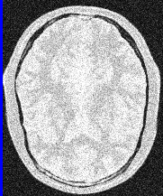
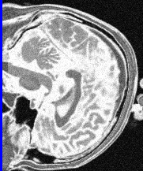
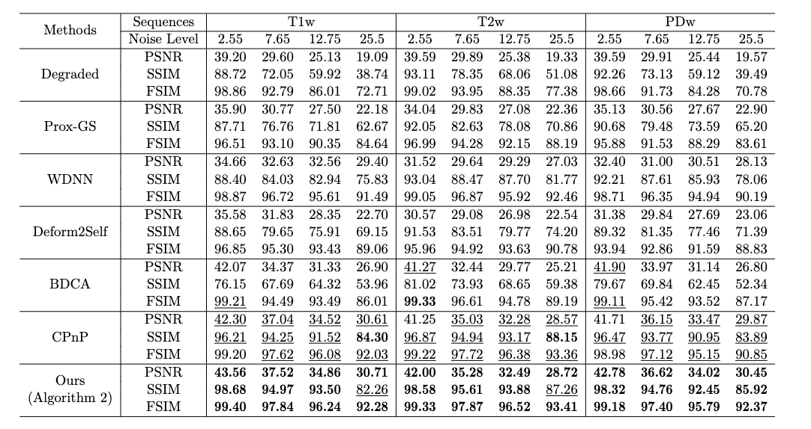
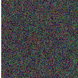
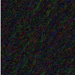
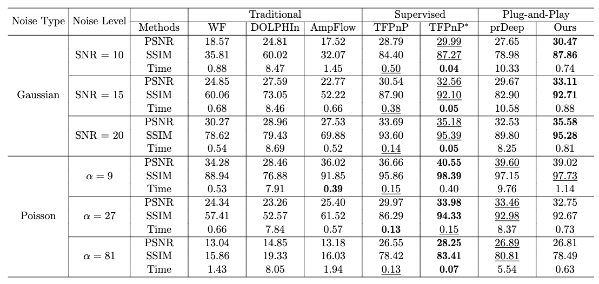

# Inertial Proximal Difference-of-Convex Algorithm with Convergent Bregman Plug-and-Play
[**Tsz Ching Chow**](https://github.com/nicholechow), [**Chaoyan Huang**](https://scholar.google.com/citations?user=Sun7dRgAAAAJ&hl=en&oi=ao), [**Zhongming Wu**](https://scholar.google.com/citations?user=-Ptg1-0AAAAJ&hl=en&oi=ao), [**Tieyong Zeng**](https://scholar.google.com/citations?user=2yyTgRwAAAAJ&hl=en&oi=ao), [**Angelica I. Aviles-Rivero**](https://scholar.google.com/citations?user=q5AA4lEAAAAJ&hl=en&oi=ao)

[[paper arxiv](https://arxiv.org/pdf/2409.03262)]  

## News
- 2026.07.31 : 🎉 Our paper has been accepted by *Inverse Problems*!
- 2024.09.06 : Initial release of the codebase for the paper "Inertial Proximal Difference-of-Convex Algorithm with Convergent Bregman Plug-and-Play for Nonconvex Imaging". 

## Prerequisites:
This code requires `torch>= 1.8.0` and `pytorch-lightning`. Please install dependencies by running the following command:
```
conda env create -f environment.yml
```

## Pretrained Checkpoint
Download the pretrained Prox-DRUNet checkpoint from [here](https://plmbox.math.cnrs.fr/f/faf7d62213e449fa9c8a/?dl=1) and save it as `GS_denoising/ckpts/Prox-DRUNet.ckpt`. Alternatively, run the following command from the root of the repository:
```
mkdir -p GS_denoising/ckpts
wget "https://plmbox.math.cnrs.fr/f/faf7d62213e449fa9c8a/?dl=1" -O GS_denoising/ckpts/Prox-DRUNet.ckpt
```


Rician Noise Removal (added parula colormap for better visualization)
----------
### Testing
```
cd PnP_restoration
python PnP_iBPDCA_denoise.py
```

[](https://imgsli.com/MjkyNzc1) 
[](https://imgsli.com/MjkyNzcz) 

- Denoising Results on BrainWeb dataset

 


Phase Retrieval
----------
### Testing
```
cd PnP_restoration
python PR_iBPDCA_gaussian.py # for Gaussian noise
python PR_iBPDCA_poisson.py # for Poisson noise
```
- Phase retreival results with four coded diffraction patterns (the following is for visual demonstration purposes only! It is not possible to pack four observations in a RGB image!)

[](https://imgsli.com/MjkyNzc1) 
[](https://imgsli.com/MjkyNzcz) 

- Denoising Results on prDeep12 dataset

 


Citation
----------
```
@article{chow2026inertial,
  title={Inertial Proximal Difference-of-Convex Algorithm with Convergent Bregman Plug-and-Play for Nonconvex Imaging},
  author={Chow, Tsz Ching and Huang, Chaoyan and Wu, Zhongming and Zeng, Tieyong and Aviles-Rivero, Angelica I.},
  journal={Inverse Problems},
  year={2026}
}

```

Acknowledgments
----------
This repository is forked from [Prox-PnP](https://github.com/samuro95/Prox-PnP), the official implementation of the Proximal Gradient Step Denoiser by Hurault et al. We thank the authors for making their code and the pretrained Prox-DRUNet denoiser publicly available.
# PnP-iBPDCA
